# houdini_hda_collection

Houdini Digital Assets Collection

---

## SOP Nodes

### fake_window (VOP: Fake Window)

A shader similar to Unity's Fake Window. Outputs a simple color from the perspective camera.

|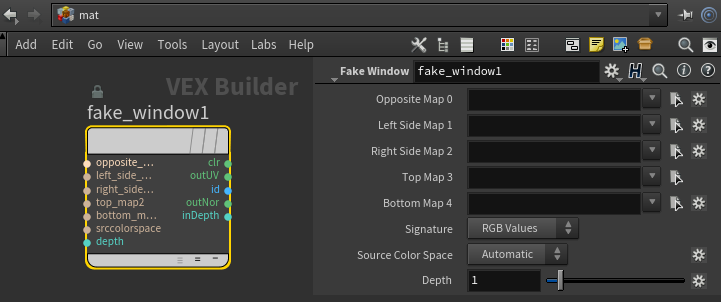|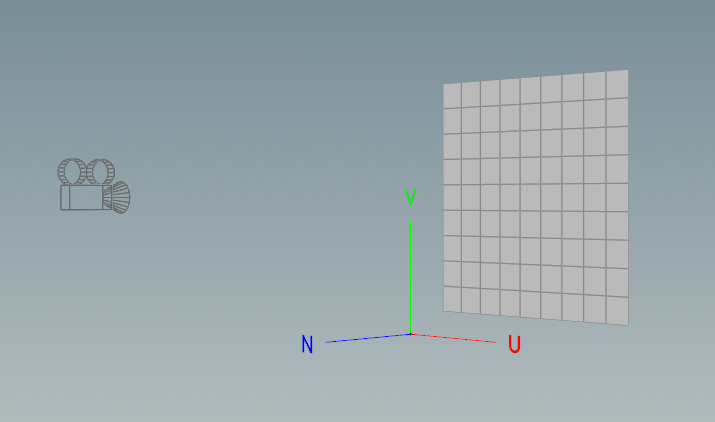|
|:---:|:---:|
|Vop in MatNetwork|Pre-set: UV and Normal|

* Depth: Maximum depth value when outputting inDepth.
* Outputs:

    |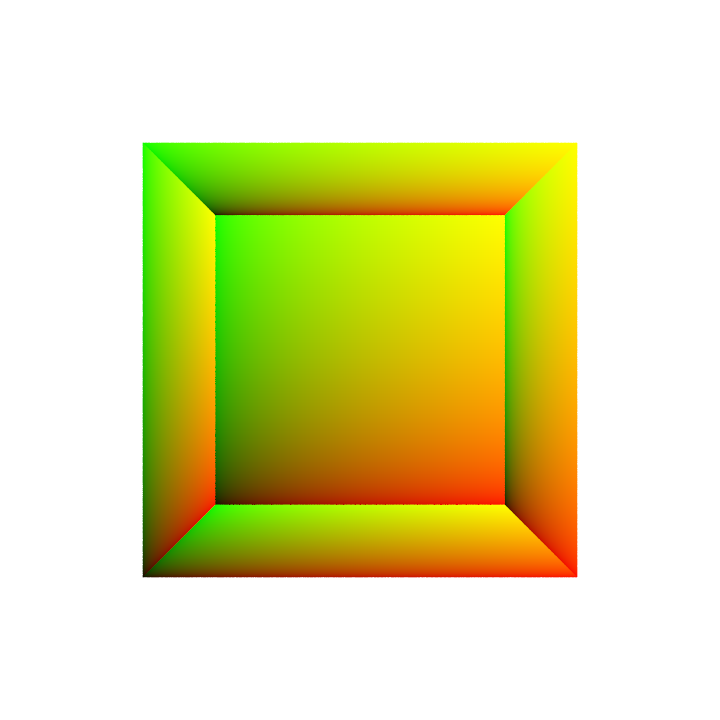|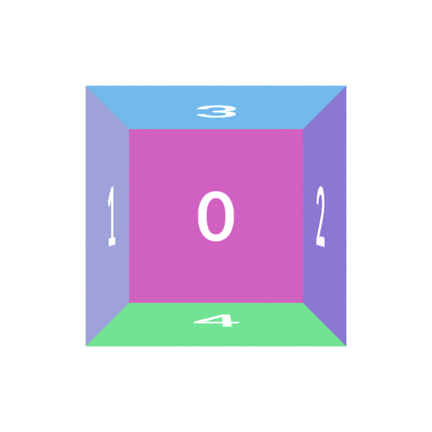|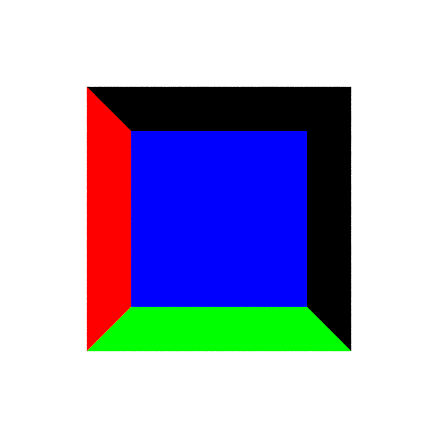||
    |:---:|:---:|:---:|:---:|
    |outUV|id|outNor|inDepth|

### grid_cutter (SOP: Grid Cutter)

|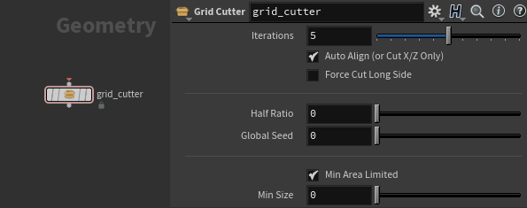|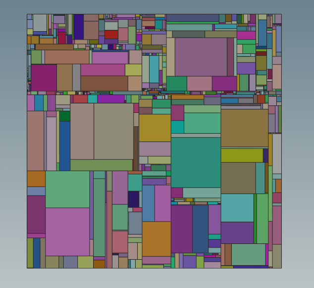|
|---|---|

* Auto Align: Aligns the face to the X/Z plane before cutting. (Useful when using grid_cutter in a For-Each Primitive loop.)
  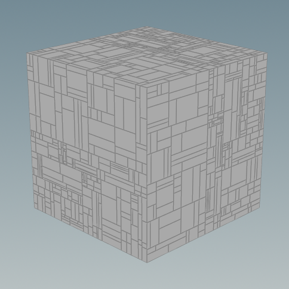
* Force Cut Long Side: Cuts the longer side at each iteration.
  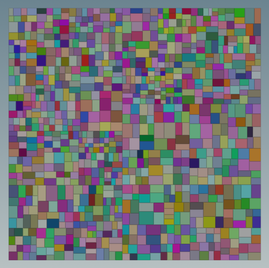
* Half Ratio: How close each cut is to the halfway point.

  | 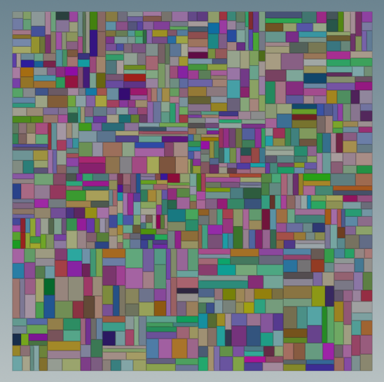|  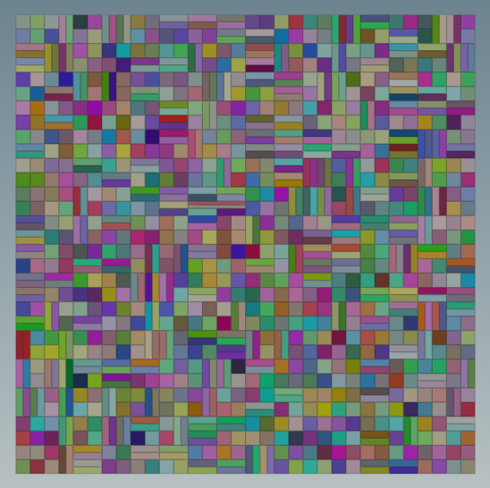 |
  |:----:|:----:|
  | Half Ratio: 0.5 | Half Ratio: 1 |

* Min Size: Limits the size of the smallest piece.

### line_cracker (SOP: Line Cracker)

Fractures based on polyline projection (X/Z plane).

|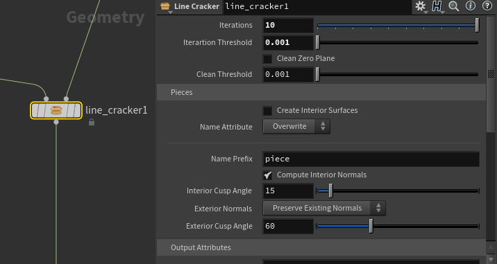|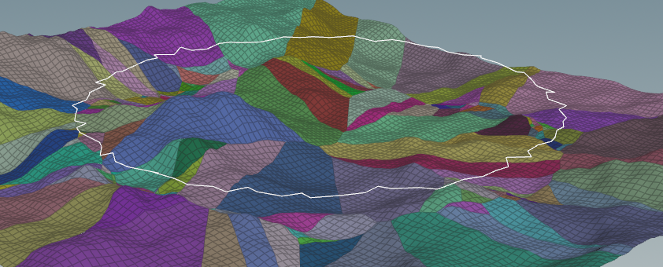|
|---|---|

> Input 1: polyline.  
> Input 2: Ground plane (does not need to be flat)  
> Output: Fractured polygons with attributes.

|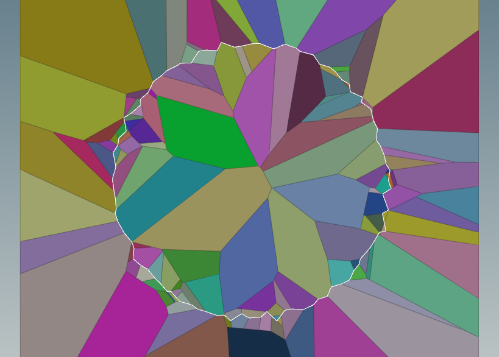|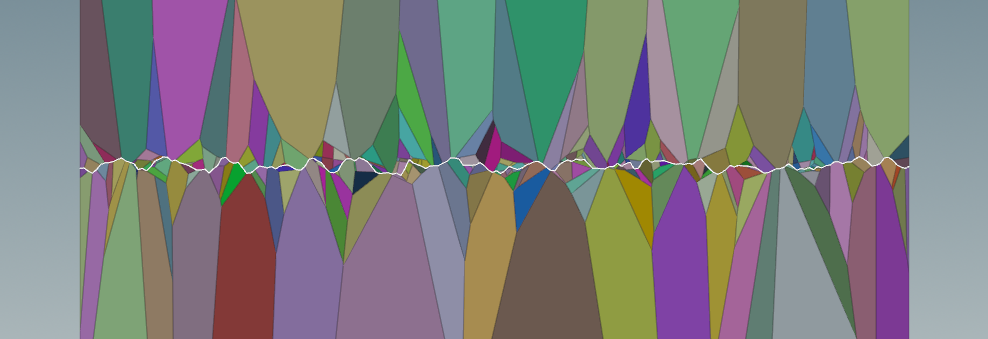|
|:---:|:---:|
|Close Line|Open Line|

* Iterations: Increase to better match the input line. (May not be a perfect match.)
* Iteration Threshold: Avoids extremely small pieces.

### matrix_deformer (SOP: Matrix Deformer)

Deforms geometry using a matrix derived from reference geometry.

> Input 1: Geometry to deform  
> Input 2: Rest geometry  
> Input 3: Deformer geometry

### sop_check_sequence_files_status (SOP: Check Sequence Files Status)

Visualizes sequence file status using Houdini point data — showing file size and modification time.

Non-existent files appear in red and are added to the `non_exist` point group. Point attributes include: `size`, `mod_time`, `frame`, `file_path`, `exists`. Point groups: `size`, `time`.

* Files: Sequence files to visualize.
* Start/End: Frame range.
* Preview Length: Range of generated points along the X-axis.
* Preview Height: Range of generated points along the Y-axis.
* Font Size: Guide text size.

### sop_fetch_pointinstancer_points (SOP: Fetch PointInstancer Points)

Fetches point data from a USD PointInstancer primitive into SOP geometry.

* LOP Path: Path to the LOP node containing the stage.
* Primitives: USD PointInstancer primitive to fetch.

### sop_smooth_polyline (SOP: Smooth Polyline)

Smooths polyline curves.

* Bias: Smoothing bias (0–1).
* Step: Number of smoothing iterations.

### thunder_builder (SOP: Thunder Builder)

Procedurally generates lightning bolt geometry from a polyline.

> Input 1: Rest line  
> Input 2: Animated line to match (optional)

* Match Tip: Snap the end of the bolt to the tip of the input line.
* Match Animated: Follow the animated input line each frame.
* Segments: Number of segments in the generated bolt.
* Growthing: Growth amount (0–1).
* Tail Attrib: Output a tail point attribute.
* Main tab: Noise Type, Frequency, Offset, Fractal Type, Roughness, Bias Angle, Exponent, Bias Along Curve ramp.
* Branch tab: Branch probability, Max Branch count, Seed, Angle settings, Branch Step settings, Noise settings.

### vector_intersect (SOP: Vector Intersect)

Finds intersection points between vectors.

* Tolerance: Intersection tolerance distance.

---

## LOP Nodes

### lop_bbox_proxy_create (LOP: BBox Proxy Create)

Creates a bounding box proxy for specified primitives, replacing a given purpose (Default / Render / Proxy).

* Primitives: USD primitives to create proxy for.
* Original Purpose: The purpose to replace (Default / Render / Proxy).

### lop_bind_materials_by_collection_name (LOP: Bind Materials By Collection Name)

Binds materials to primitives by matching collection names to material names.

* Collections: Root path of collections.
* Materials: Root path of materials.
* Primitive: Target primitive to apply bindings to.

### lop_build_simple_bgeo_clip (LOP: Build Simple bgeo Clip)

Builds USD value clips from a bgeo sequence. Requires a `usdconfigure` SOP to set the sample frame detail attribute on the bgeo files. Writing to disk also produces a `<output>.manifest.usd` sidecar next to the output, referenced by a relative path, so it must travel alongside the output file.

* File: bgeo sequence path.
* Template Frame: Frame used as the clip template.
* Clip: Clip set name.
* Files Frame Start/End: Frame range of the source bgeo files.
* Scene Frame Start/End: Frame range in the USD scene.
* Loop: Enable looping.
* Primitive: Target USD primitive path (must match the prim path the bgeo imports to).
* Output File: Path to write the clip USD file.
* Save to Disk: Write the output USD file and generate the manifest sidecar.
* Use Relative Paths: Write relative paths in the output USD.

### lop_create_class_from_primtive (LOP: Create Class from Primitive)

Creates a USD class primitive and moves the hierarchy below a specified primitive into it.

* Primitive: The primitive whose hierarchy will be placed in the class.
* Class: Name for the new class primitive (specifier will be `class`).
* New Name: Optionally rename the top-level prim when placed in the class.

### lop_create_crowd_collections_by_agent_stage_material (LOP)

Creates USD collections based on the material binding names of the source agent mesh.

* Collection: Collection prim path.
* From Path
* Replace Path

### lop_create_mesh_rest_primvar_layer (LOP: Create Mesh Rest Primvar Layer)

Creates a USD layer that adds a rest primvar to mesh primitives.

* Root Primitive: Root of the prim hierarchy to process.
* Primvar Name: Name of the rest primvar (default: `rest`).

### lop_custom_houdini_procedural (LOP: Custom Houdini Procedural)

Sets a specified primitive to use a Houdini Procedural for rendering.

> **WARNING:** The render command must include `--allowed-procedurals all` unless only curves and points are used.

* Graph File: The SOP-level graph file for the procedural.
* Procedural Name: Name of the Houdini Procedural.
* Procedural Primitive: The primitive to make procedural.
* Inputs: Primitives to use as graph inputs.
* Overrides: Override graph parameters and USD primitive properties.

### lop_kill_camera_motion_blur (LOP: Kill Camera Motion Blur)

Removes all time samples from camera primitives to disable camera motion blur only.

### lop_kill_time_sample (LOP: Kill Time Sample)

Removes all time samples from specified primitives, collapsing animated properties to a single value.

* Primitives: USD primitives to process.
* Frame: The frame value to retain when flattening time samples.

### lop_load_sequence_vdbs (LOP: Load Sequence VDBs)

Creates a USD stage with a Volume and one OpenVDB primitive per grid from a VDB file sequence. The `filePath`, `fieldName`, and `fieldIndex` properties of each OpenVDB primitive are time-sampled.

* Parent Primitive: Root path for the Volume primitive.
* Primitive Name: Name of the Volume primitive.
* VDB Files: Sequence file path.
* Start/End: Frame range.
* Grids: Grid names to include (space-separated). One OpenVDB primitive is created per grid.
* Grid Index: Grid index (usually 0).
* ExtentsHint From File: Load each VDB per frame to compute and write a time-sampled `extentsHint` on the Volume. Accurate but slow.

### lop_manually_set_extentsHint (LOP: Manually Set ExtentsHint)

Manually sets `extentsHint` on a primitive from a manual value, SOP node, geometry file, or VDB file. Supports time-dependent mode to write time samples.

* Prim Path: Primitive to set extentsHint on.
* Time Dependent: Enable per-frame time sampling.
* Start/End: Frame range (when Time Dependent is enabled).
* Manually: Min/Max bound values.
* From SOP: SOP Path, Group Type, Group name.
* From Files: File path, Group Type, Group name.
* From VDB Files: VDB file path.

### lop_modify_pointInstancer_from_sop_points (LOP: Modify PointInstancer from SOP Points)

Updates PointInstancer data using point attributes from a SOP node.

* PointInstancer Primitive: Target PointInstancer USD prim path.
* SOP: Source SOP node.
* Positions: Sync from `P` attribute.
* Orientations: Sync from `orient` attribute.
* Scales: Sync from `scale` attribute.
* ProtoIndices: Sync from `index` attribute.
* InvisibleIds: Sync from `invisible` attribute.

---

## VOP Nodes

### fisheye_vex (VOP: Fisheye Lens VEX)

A CVEX lens shader that applies a fisheye distortion for Mantra rendering.

* FOV: Field of view in degrees (default: 180).
* Mask: Enable/disable masking outside the circular frame.

### Mandelbrot3D (VOP)

[Entagma - VEX in Houdini: Mandelbrot and Mandelbulb](https://vimeo.com/176911687)

[Zeus VFX - 3D Fractal in Houdini Tutorial](https://youtu.be/-qgtQ91oItQ)

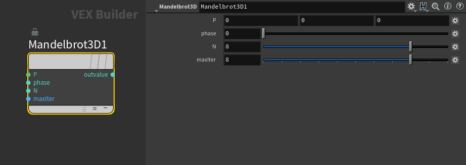

### motion_vector (VOP: Motion Vector)

Outputs a screen-space motion vector, scaled to pixel dimensions for use in motion vector AOVs.

* Width Pixel: Horizontal resolution multiplier (default: 1920).
* Height Pixel: Vertical resolution multiplier (default: 1080).

### volume_texture (VOP: Volume Texture)

Reuse the volume texture exported from **Labs Volume Texture Export** in Houdini.
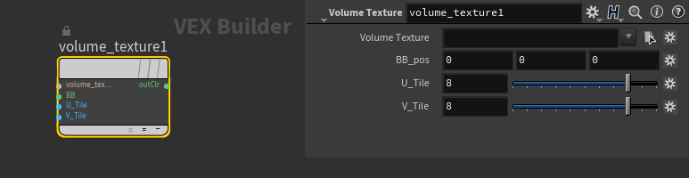

* Volume Texture: Texture filepath.
* BB_pos: Bounding box position.
* U_Tile
* V_Tile
* outClr: RGB color from the volume texture.

---

## TOP Nodes

### top_collect_stage_textures (TOP: Collect Stage Textures)

Collects all textures referenced in a USD stage and copies them to a new directory, replacing the path prefix.

* Stage LOP Node: The LOP node providing the USD stage.
* Texture Root Path: Source texture root path to match against.
* Copy To: Destination directory.
