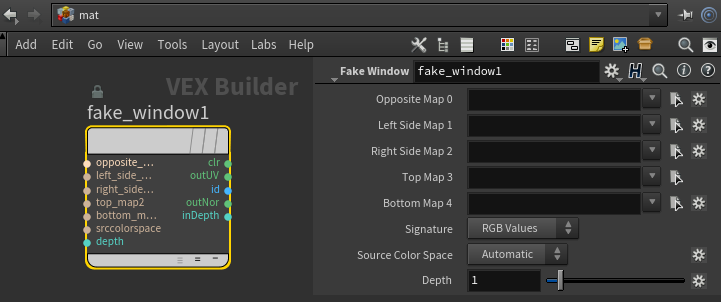
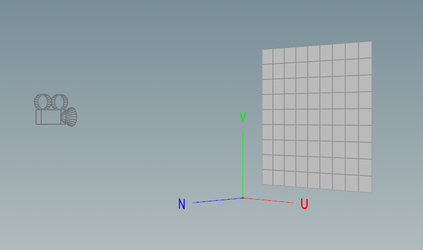
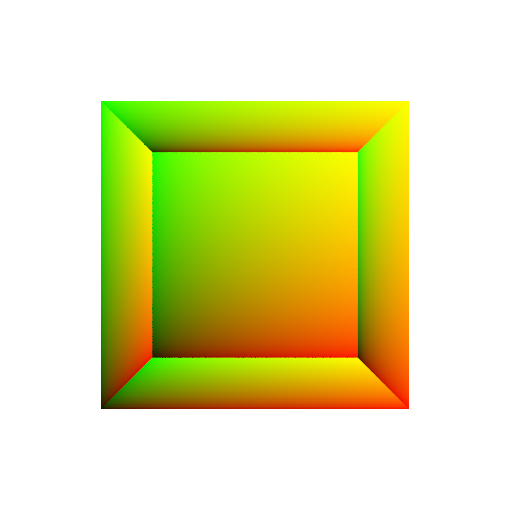
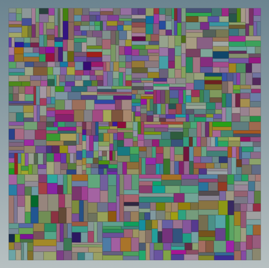
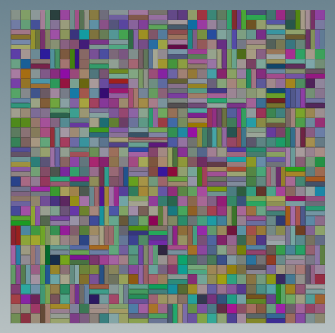
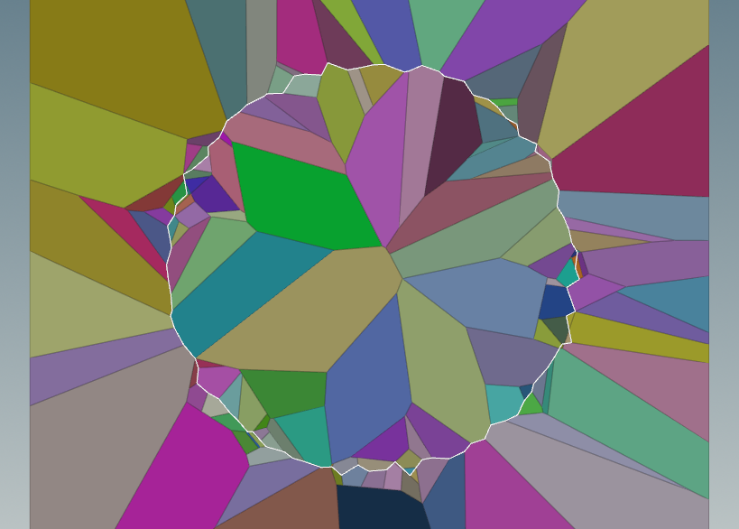
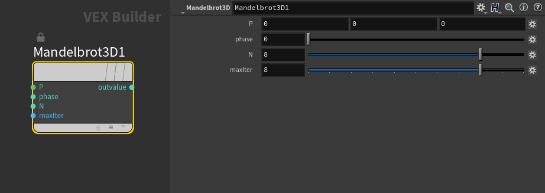

# houdini_hda_collection

Houdni Digital Assets Collection

---

## fake_window (VOP: Fake Window)

Something like Fake Window shader in Unity. Output simple color from perspective camera.

|||
|:---:|:---:|
|Vop in MatNetwork|pre-setting: UV and Normal|

* Depth: Max depth value when output inDepth.
* Outputs:

    |||||
    |:---:|:---:|:---:|:---:|
    |outUV|id|outNor|inDepth|

---

## grid_cutter (SOP: Grid Cutter)

|||
|---|---|

* Auto Align: Align the face to X/Z before cutting.
  (Useful when using grid_cutter in For-Each Primitive)
  
* Force Cut Long Side: Cut the long side at each iteration.  
  
* Half Ratio: How close to half everytime cutting.

  | |   |
  |:----:|:----:|
  | Half Ratio: 0.5 | Half Ratio: 1 |

* Min Size: Limit the size of smallest piece.

---

## line_cracker (SOP: Line Cracker)

Fracture base on polyline projection. (X/Z plane)  

|||
|---|---|

> Input 1: polyline.  
> Input 2: Ground plane (Don't need to be flatten)  
> Output: Fractured poly with attributes.

|||
|:---:|:---:|
|Close Line|Open Line|

* Iterations: Increase to match the input line. (Maybe can not be perfect match.)
* Iteration Threshold: Avoid extreme small piece.

---

## export_Maya_nParticles_cache (SOP: Export Maya nParticle cache)  

*Export Maya nParticle cache from Houdini directly.*  

REQUIREMENT:  

1. unique id attribute.
2. [source code: nCache.py](https://github.com/chordee/mayaGeoCache)  

Attribute Mapping:  

```
v@v -> velocity
f@age -> age
f@life -> lifespanPP
f@pscale -> radiusPP
v@Cd -> rgbPP
f@Alpha -> opacityPP
v@rotation -> rotationPP
```

  

* Start Frame
* End Frame
* Evaluation Rate
* XML: xml file path to be written.
* Particle Name: Particle Shape name in Maya.
* Python Module Path: [nCache.py](https://github.com/chordee/mayaGeoCache/blob/master/nCache.py) filepath.

---

## export_Maya_geoCache (SOP: Export Maya geoCache)  

*Export Maya geometry point cache from Houdini directly. (Multiple objects is ok)*  

REQUIREMENT:  

1. Primitive attribute: path.
2. [source code: nCache.py](https://github.com/chordee/mayaGeoCache)  

> path attribute is used to define the target in Maya. Therefore, the best way is using the alembic which was exported from Maya, and keep the path attribute so that can be used to export back.


* XML: xml file path to be written.
* Start Frame
* End Frame
* Python Module Path: [nCache.py](https://github.com/chordee/mayaGeoCache/blob/master/nCache.py)

---

## Mandelbrot3D (VOP)

[Entagma - VEX in Houdini: Mandelbrot and Mandelbulb](https://vimeo.com/176911687)  

[Zeus VFX - 3D Fractal in Houdini Tutorial](https://youtu.be/-qgtQ91oItQ)  
  
  

---  

## volume_texture (VOP: Volume Texture)  

Reuse the volume texture which was exported from **Labs Volume Texture Export** in Houdini.  


* Volume Texture: Texture filepath.
* BB_pos: bbox position.
* U_Tile
* V_Tile
* outClr: RGB color from volume texture.  

---

## create_crowd_collections_by_agent_stage_material (LOP)

Create collections by the name of material binding with source agent mesh.


* Collection: collection prim path
* From Path
* Replace Path

---

## thunder_builder (SOP: Thunder Builder)
